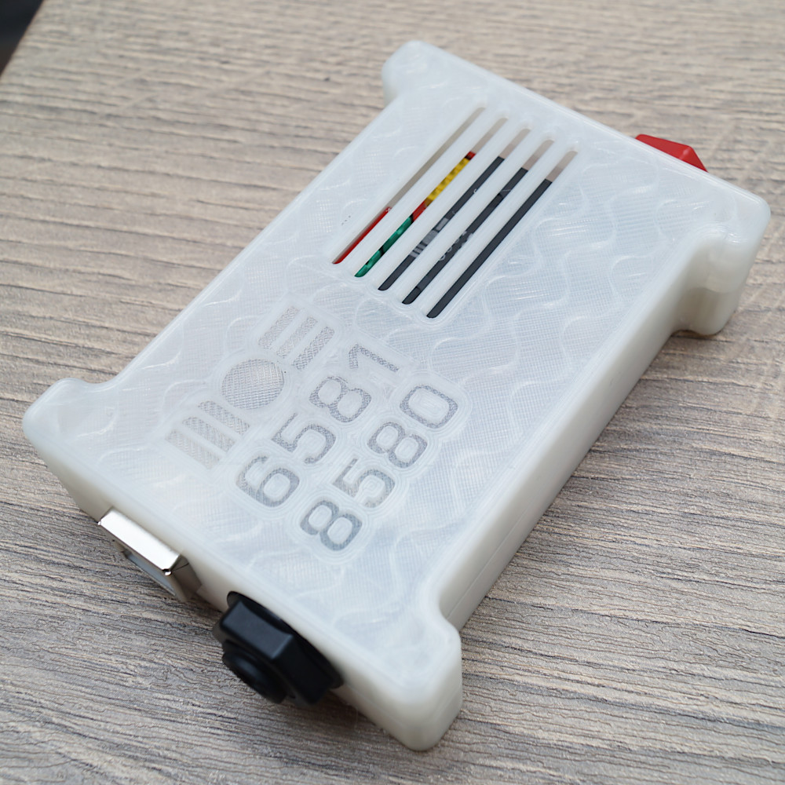
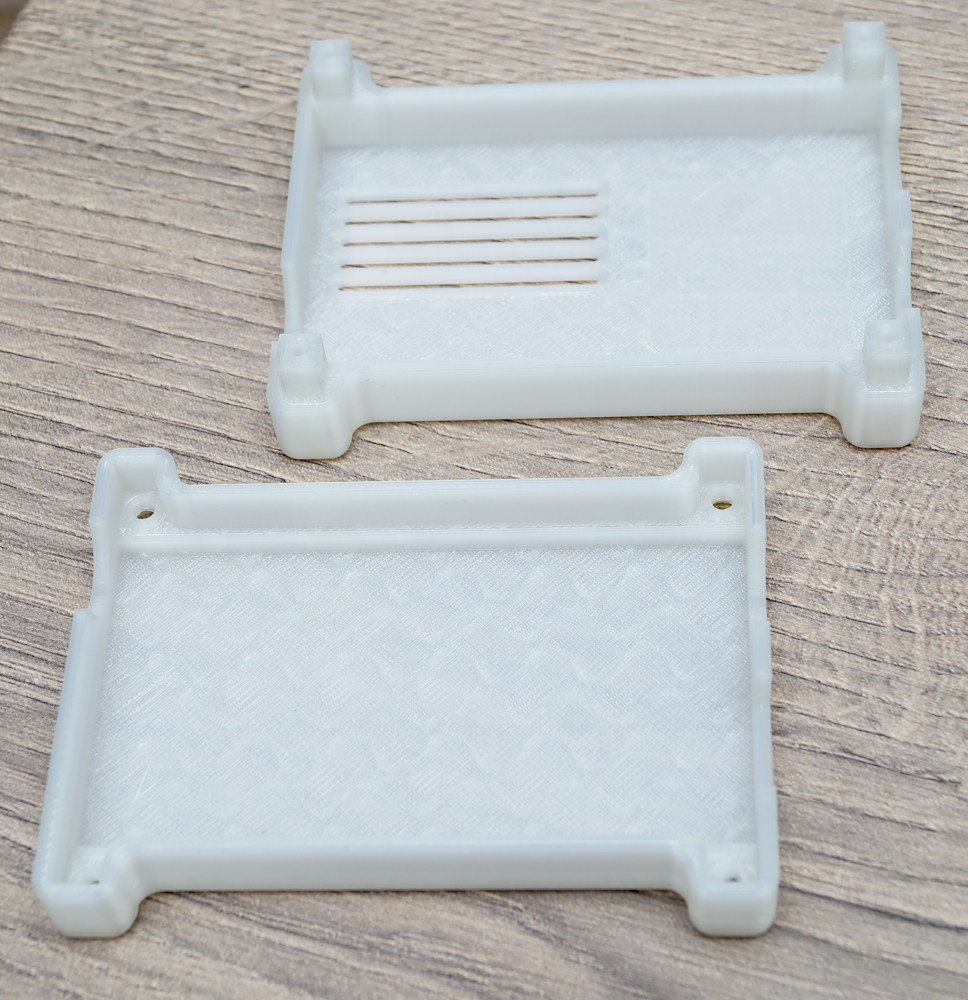
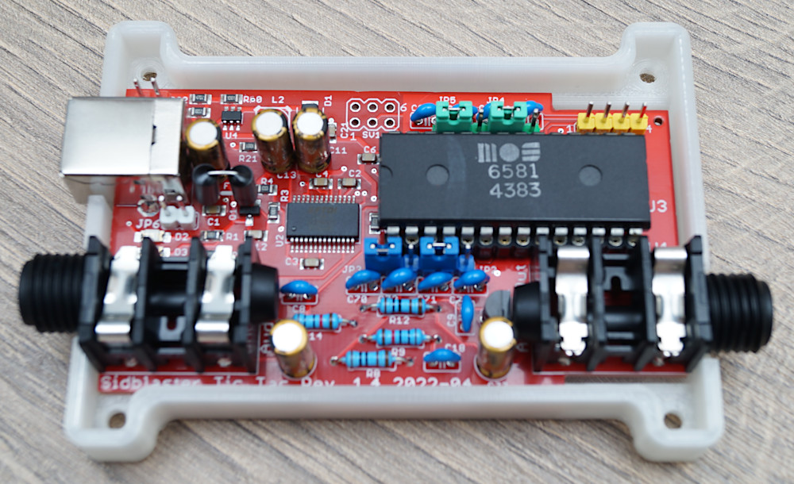
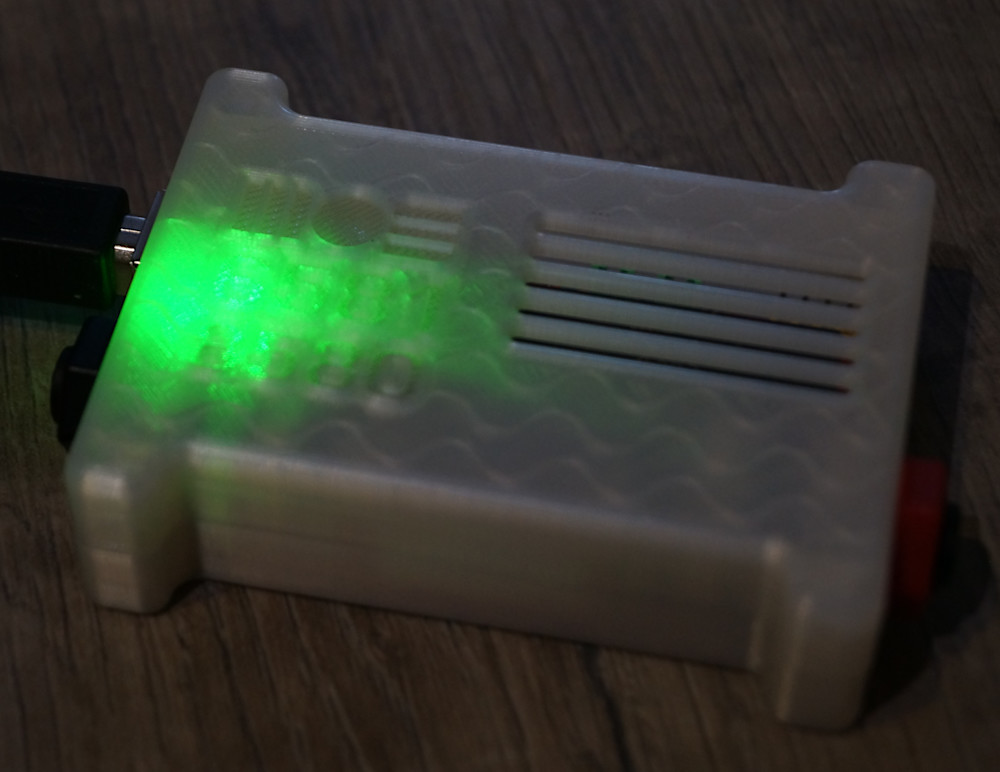

3D-printed case for SIDBlaster-USB Tic-Tac Edition by tyristori.

Two different versions of top part included. With and without the text.

Use 3 x 12 screws.

 This work is licensed under a <a rel="license" href="http://creativecommons.org/licenses/by/4.0/">Creative Commons Attribution 4.0 International License</a>.

