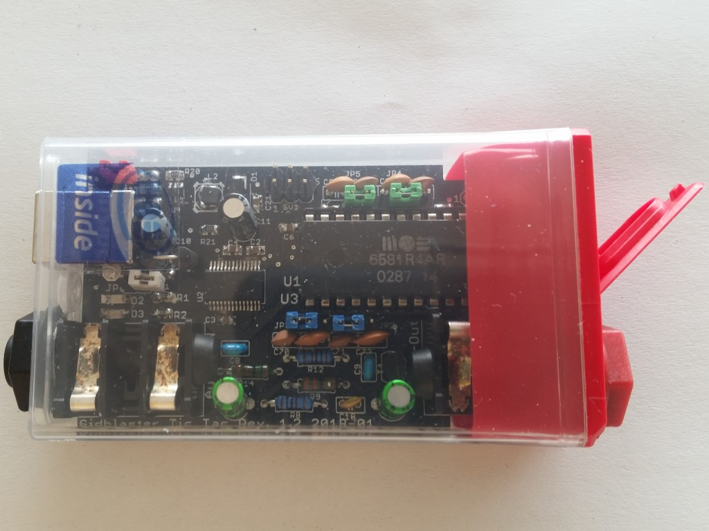

# SIDBlaster-USB Tic Tac Edition

**Open-source USB hardware for a genuine MOS 6581/8582 SID chip** - C64 sound
on real silicon, on your PC's USB port. Small enough to fit in a "Tic Tac"
mint box (hence the name), it plugs into a USB port and appears to host
software as a HardSID-compatible device: play SID tunes with cycle-accurate
hardware sound, or use it as a real analog synth voice from a DAW.

- - -

## What's in the box

- A genuine SID chip (6581 or 8580/8582 - your choice, whatever you socket)
  driven by a Microchip PIC16F886 and an FTDI FT245R USB-to-parallel-FIFO
  bridge
- A 6.3mm (1/4") jack audio output, studio-ready out of the box - unlike
  most RP2040-based SID-USB alternatives
- Open PCB design (Eagle + Gerber), currently at hardware revision **1.5**
- Firmware (MPASM source + compiled HEX) for the PIC16F886
- A 3D-printable case (by tyristori)
- Full German/English assembly instructions, user manual and bill of
  materials

The [driver](https://github.com/gh0stless/SIDBlasterUSB_HardSID-emulation-driver)
supports up to **8** units side by side - handy for multi-SID setups
(stereo/triple-SID playback) and for music-instrument applications like
[AIASS](https://github.com/gh0stless/AIASS-Uno-VST) that want several
independent SID voices at once.

- - -

## Repository layout

| Folder | Contents |
|---|---|
| [`pcb/`](./pcb) | Eagle schematic/board files + Gerbers, revisions 1.2 - 1.5 |
| [`pic16f886/`](./pic16f886) | PIC16F886 firmware - MPASM source and compiled `.hex` |
| [`ftdi_template/`](./ftdi_template) | FT_PROG templates for programming the FT245R USB chip |
| [`docs/`](./docs) | Assembly instructions, user manual, bill of materials (BOM) per revision - PDF + editable ODT/ODS sources |
| [`datasheet/`](./datasheet) | MOS 6581/6582 SID and MT3608 datasheets |
| [`3d_printed_case/`](./3d_printed_case) | 3D-printable case (Blender + STL), CC BY 4.0 |
| [`exSIDBlaster/`](./exSIDBlaster) | How to convert a SIDBlaster-USB into a (single-SID) exSID |
| [`hardsid_library/`](./hardsid_library) | Plain prebuilt `hardsid` driver binaries (Win/Linux/macOS) - see below for the current source/releases |
| [`images/`](./images) | Product photos |

- - -

## Getting started

1. **Build or buy** the hardware - follow the
   [assembly instructions](./docs/assembly%20instructions.pdf) /
   [Aufbauanleitung](./docs/Aufbauanleitung.pdf) and the current
   [BOM (Rev.1.5)](./docs/bill%20of%20materials%20%28BOM%29%20Rev.1.5.pdf).
2. **Program** the PIC (firmware in [`pic16f886/`](./pic16f886)) and the
   FTDI FT245R (template in [`ftdi_template/`](./ftdi_template), via FT_PROG).
3. **Install the driver** - the FTDI D2XX driver plus the `hardsid` HardSID
   emulation library. Get an installer or the latest plain binaries from
   [crazy-midi.de](https://crazy-midi.de) or the driver's own repo, see
   below.
4. **Play something** - any HardSID-aware player (Sidplay2, ACID64, VICE, ...)
   or a purpose-built app such as
   [SIDBlaster ASID Player](https://github.com/gh0stless/SIDBlaster-ASID-Player)
   (turns it into an ASID-protocol MIDI synth) or
   [AIASS](https://github.com/gh0stless/AIASS-Uno-VST) (VST/Standalone
   instrument plugin).

Full details are in the [manual](./docs/SIDBlaster-USB%20Tic%20Tac%20Edition%20User%20Manual.pdf)
/ [Handbuch](./docs/SIDBlaster-USB%20Tic%20Tac%20Edition%20Handbuch.pdf).

- - -

## The software ecosystem

This repo covers the **hardware**. The driver and applications that make it
useful live in their own actively maintained repos:

- **[SIDBlasterUSB_HardSID-emulation-driver](https://github.com/gh0stless/SIDBlasterUSB_HardSID-emulation-driver)** -
  the `hardsid` driver (Windows/Linux/macOS), source + releases. This is
  what any HardSID-compatible player talks to - except ACID64 and
  JSIDPlay2, which bring their own onboard SIDBlaster-USB support.
- **[SIDBlasterTool](https://github.com/gh0stless/SIDBlasterTool)** -
  small device config utility (read/set a device's serial number and SID
  chip type).
- **[SIDBlaster ASID Player](https://github.com/gh0stless/SIDBlaster-ASID-Player)** -
  standalone app that turns the device into an ASID-protocol MIDI synth.
- **[AIASS-Uno-VST](https://github.com/gh0stless/AIASS-Uno-VST)** - VST/VST3/
  Standalone instrument plugin driving the SID chip directly from a DAW.
- **[libsidplayfp](https://github.com/gh0stless/libsidplayfp)** (fork) -
  adds a `sidblaster-builder` backend so any libsidplayfp-based player
  (e.g. [sidplayfp](https://github.com/gh0stless/sidplayfp)) can play SID
  tunes through real SIDBlaster-USB hardware via `hardsid`, on
  Windows and Unix (dlopen).
- **SIDBlaster NG** - a from-scratch firmware + driver stack, built on the
  exSID protocol, for a new hardware revision. RP2040-based SID-USB devices
  (e.g. [USBSID-Pico](https://github.com/LouDnl/USBSID-Pico)) may well be
  where the present and future belong for a single device on a desk - but
  SIDBlaster's scalability is unique: several units side by side (see
  [above](#whats-in-the-box)) is exactly what music applications like
  [AIASS](https://github.com/gh0stless/AIASS-Uno-VST) want. NG is planned
  around that: active multi-device handling, hotplug, and resource
  management, not just more units bolted onto the same driver model.

Prebuilt installers for all of the above (handles driver placement,
Linux udev rule, macOS D2XX symlink, etc. for you): **[crazy-midi.de](https://crazy-midi.de)**.

- - -

## Turning it into an exSID

Want [exSID](https://github.com/jpandersen/exSID)-grade playback instead?
See [`exSIDBlaster/`](./exSIDBlaster) for a one-wire hardware hack plus a
firmware/template swap that converts a SIDBlaster-USB into a (single-SID)
exSID-compatible device, for use with e.g. JSIDPlay2. Do-it-yourself, at
your own risk.

- - -

## License

Hardware design and documentation in this repository are licensed under
**GPL v3** (see [`LICENSE`](./LICENSE)). The [`pic16f886/`](./pic16f886)
firmware is **MIT**-licensed. The 3D-printed case files are **CC BY 4.0**
(see [`3d_printed_case/`](./3d_printed_case)). The original exSID firmware
referenced in [`exSIDBlaster/`](./exSIDBlaster) is licensed by the exSID
project under **Creative Commons**, not by this repository.

- - -

## Credits

Designed by Andreas Schumm (gh0stless), crazy-midi.de, building on the
original SIDBlaster concept - whoever first came up with it, thank you,
whoever you are; your name didn't reach me, but the idea did.

Thanks to Stein Pedersen for the original `hardsid` driver, Wilfred Bos for
his help with it and for SIDBlaster-USB support in ACID64Player, and Ken
Händel for the Linux/macOS driver port. exSID conversion notes courtesy of
the exSID project (Thibaut Varène). 3D-printed case by tyristori.

And to my long-time fiancée, Borjana Konstantinowa, for her patience with me.

Andreas Schumm (gh0stless)
contact: info@crazy-midi.de
