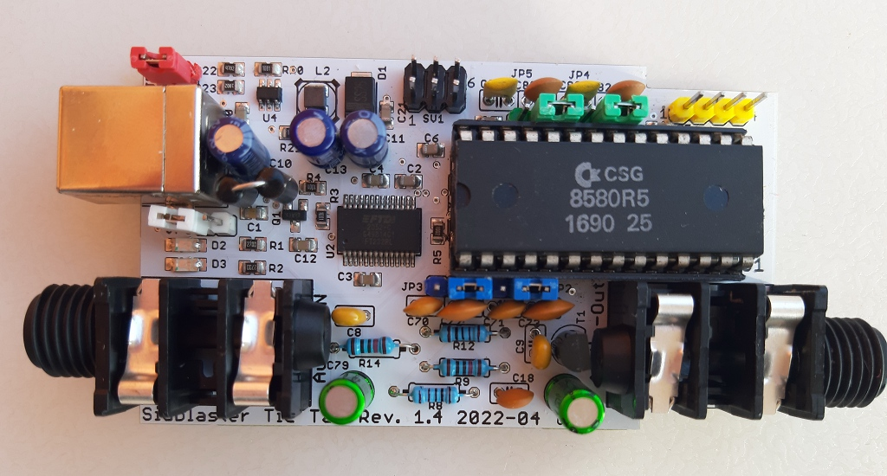
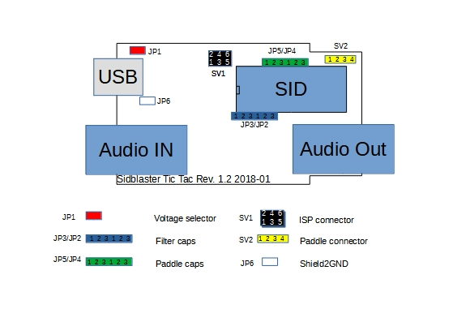
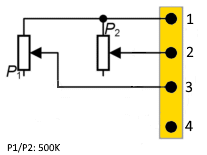
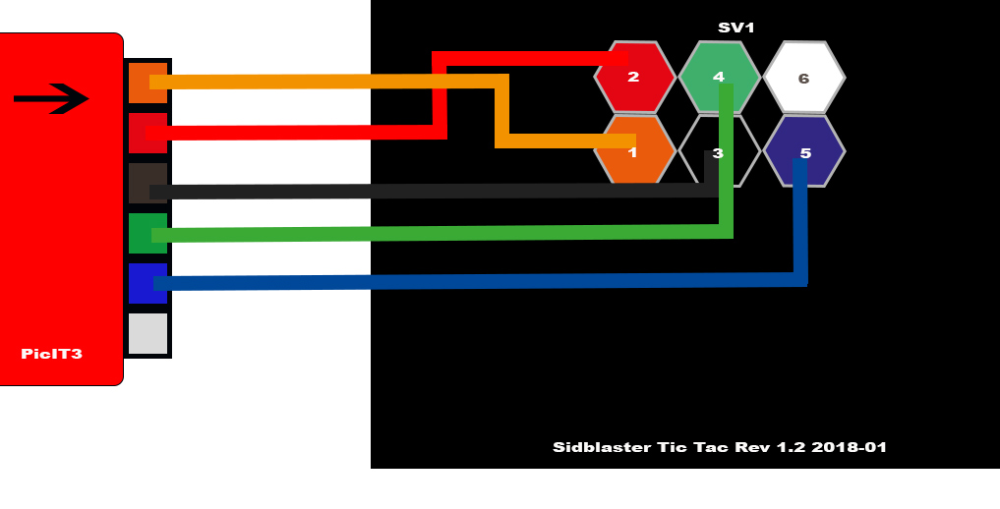

# SIDBLASTER-USB — TIC TAC EDITION

*– A real SID Chip on PC or Mac*

## USER MANUAL

by Andreas Schumm, Rev. 1.4

Copyright© 2024 [www.crazy-midi.de](http://www.crazy-midi.de/) – License: [CC BY-ND 4.0](https://creativecommons.org/licenses/by-nd/4.0/deed.en)

---

# 1. Introduction

The SIDBlaster-USB Tic Tac comprises premium "open-source" hardware for using a genuine "SID"-sound chip for C64 emulation, playback of SID tunes and music production as a little box on the USB port of a personal computer or Mac.

SIDBlaster-USB Tic Tac is based upon "SIDBlaster-USB", and is 100% compatible with it.

## 1.1 Improvements

- Good value universal current supply 9V or 12V
- Original C64-audio wiring
- Optional connection facility for two Paddles
- Switchable filter capacitors
- Switchable capacitors for Paddle
- Precisely fitting printed circuit board for assembly into a Tic Tac candy box
- Audio-In
- Professional 6,3mm mono audio jack sockets
- Cozy blue power LED
- (Rev.1.2:) red TX/RX-LED
- (Rev. 1.2 white jumper to connect GND and shield (experimental)
- prepared for read access (firmware 1.1)

# 2. General information

- Plug and play is not possible, the SIDBlaster must be plugged in before using in an application. Also, do not unplug the SIDBlaster before you have finished the application.
- When you are not using the SIDBlaster it is recommended to unplug the USB-connection since this prolongs the life of the SID-chip.
- Since a SID-chip produces heat, use a heat-sink on the chip if possible and make sure there is sufficient ventilation (leave the flap of the Tic Tac candy box open).

# 3. Hardware installation

## 3.1 SID-chip installation



*A SIDBlaster-USB with correctly installed 8580*

Always use ESD protection (e.g. an anti-static bracelet) to avoid damaging the SID-chip and other electrical components when installing it in the SIDBlaster.

To remove a SID chip, for example, use a screwdriver, lever it out alternately, be careful not to damage the circuit board or components. Before inserting a SID, bend the legs straight with a pair of pliers, press carefully, check that none of the legs bend over.

## 3.2 Jumper settings



### 3.2.1 For the 6581 SID-chip:

- JP1: must be open (12V).
- JP2-JP5: Place all jumpers on the left side (pins 1-2).

### 3.2.2 For the 8580 SID-chip:

- JP1: must be closed (9V).
- JP2-JP5: Place all jumpers on the right side (pins 2-3).

## 3.3 Other jumpers on the hardware

### 3.3.1 JP6 (White)

From Rev. 1.2 and on. Experimental, connects USB shield to ground; you may try it to counteract interfering noise.

### 3.3.2 SV2:Paddle connector (yellow)

Here you have access to the two A/D converters of the SID chip. For example, you can connect 2 rotary potentiometers as paddles. This is of interest for programmers. You can also use the function with the SID object for Max/MSP.

| Pin | Function |
|---|---|
| 1 | +5V |
| 2 | POTX |
| 3 | POTY |
| 4 | GND |



### 3.3.3 SV1: ISP Connector

Use a Picit 3 programmer to flash the microcontroller. MPLAB IPE is used as software.

| Pin | Function |
|---|---|
| 1 | MCLR/VPP |
| 2 | +5V |
| 3 | GND |
| 4 | PGD (ICSPDAT) |
| 5 | PGC (ICSPCLK) |
| 6 | n.c. |



## 3.4 USB and audio connections

### 3.4.1 USB jack

Connect the SIDBlaster hardware to a USB port using a type A-B USB cable of good quality. It can also work with a good quality USB-hub.

### 3.4.2 Audio-out jack

The audio output is designed as a professional 1/4" jack socket. Connect the audio output of the SIDBlaster to your mixer or audio interface using an unbalanced (mono) cable.

### 3.4.3 Audio-in jack

The second audio jack on the SIDBlaster is an audio input and is also an unbalanced connection. If you are unsure which connector is which, the connectors are marked on the PCB. Be careful about what you connect to the input of the SID-chip. These chips are old and very sensitive to electrical spikes and too high voltages.

## 3.5 exSIDBlaster (optional firmware hack)

If you want, you can convert your SIDBlaster into part of an exSID with a small hardware modification and new firmware – a project by Thibaut Varène with especially mature, cycle-accurate firmware. After the conversion you effectively have an exSID with one SID chip, usable e.g. with JSIDPlay2 (enable "Fake Stereo" there).

This is an experimental modification at your own risk – neither Andreas Schumm nor Thibaut Varène take any responsibility for it. Details on the exact procedure (cutting PIC pin 7, soldering a bridge from PIC pin 15 to SID socket pin 5, flashing new firmware) can be found in the exSIDBlaster folder of the SIDBlaster-USB-Tic-Tac-Edition repository.

# 4. Software

## 4.1 The FTDI D2XX driver

### 4.1.1 Windows

The SIDBlaster needs to do a digital "handshake" the first time it is connected via USB. This requires an internet connection. The handshake will not work if your internet connection is set to "Metered Connection" in Windows. To solve this, temporarily disable "Metered Connection", wait a moment for the SIDBlaster to do the handshake, and then re-enable "Metered Connection".

The latest Windows versions provide the FTDI driver via the update function. So check: Settings / Updates / Optional Updates.

The SIDBlaster is recognized by Windows as a "USB Serial Converter". It may be recognized as a COMx device with ports (in Device Manager). Edit: Your SIDBlaster have to be flashed correctly with the FTDI prog tool and the template from the SIDBlaster project in this case. The actual hardsid.dll doesn't accept incorrectly flashed SIDBlasters.

With older versions of Windows, installation of a driver by FTDI may be necessary, available at: <http://www.ftdichip.com/Drivers/D2XX.htm>

### 4.1.2 Linux

Download D2XX driver from: <https://ftdichip.com/drivers/d2xx-drivers/>

Please install FTDI drivers explained in chapter '2 Installing the D2XX driver' from here: <https://www.ftdichip.com/Support/Documents/AppNotes/AN_220_FTDI_Drivers_Installation_Guide_for_Linux.pdf>

If device still cannot be used, please install a workaround mentioned in chapter '1.1 Overview':

```
$ sudo vi /etc/udev/rules.d/91-sidblaster.rules

ACTION=="add", ATTRS{idVendor}=="0403", ATTRS{idProduct}=="6001", MODE="0666", RUN+="/bin/sh -c 'rmmod ftdi_sio && rmmod usbserial'"

$ sudo udevadm control --reload-rules && udevadm trigger
```

### 4.1.3 MacOS

Note: it may be necessary to switch off the security monitoring in MacOS or to authorize all developers.

```
sudo spctl --master-disable
```

Could also work:
```
sudo xattr -rd com.apple.quarantine / Your software path.app
```

Download and install D2XX Driver from: <https://ftdichip.com/drivers/d2xx-drivers/>

use the instructions from: <https://ftdichip.com/wp-content/uploads/2020/08/AN_134_FTDI_Drivers_Installation_Guide_for_MAC_OSX-1.pdf>

Download and install D2XXHelper from the same site.

## 4.2 The hardsid library

Is the "driver" resp. "middleware" of the SIDBlaster, so to say. Under windows it comprises a reprogrammed DLL of the Hardsid, thus, software programmed for the Hardsid becomes compatible for the SIDBlaster. Later the DLL was ported to linux and macos. The DLL is made and maintained by Stein Pedersen. Linux/Mac port was made by Ken Händel.

### 4.2.1 Windows

- Download from: <https://crazy-midi.de/joomla/index.php/mydownloads>
- Recommended: install the driver via its own installer (installs the DLL system-wide to Windows\System32). Alternatively, you can manually copy the right hardsid.dll into the program directory of a single program.
- The 64 bit version is required by the 64 bit version of vice and also by the 64 bit versions of AIASS.

### 4.2.2 Linux

- Download from: <https://crazy-midi.de/joomla/index.php/mydownloads>
- copy libhardsid.so to /usr/local/lib/
- apply chmod 0755 on libhardsid.so
- copy hardsid.hpp to /usr/local/include/

### 4.2.3 MacOS

- Download from: <https://crazy-midi.de/joomla/index.php/mydownloads>
- copy libhardsid.dylib to /usr/local/lib/
- copy hardsid.hpp to /usr/local/include/

### 4.2.4 SIDBLASTERUSB_WRITEBUFFER

Depending on your system, tunes with high data rates (multi speed tunes or digitunes) may play slower if the latency of the USB driver is too high. This can be remedied by setting the driver write buffer size to a larger value, for instance. Even down to 0, works on fast machines.

#### 4.2.4.1 Windows
```
set SIDBLASTERUSB_WRITEBUFFER_SIZE=8
```

#### 4.2.4.2 Linux/MacOS
```
export SIDBLASTERUSB_WRITEBUFFER_SIZE=8
```

## 4.2.5 The SIDBlasterTool

With SIDBlasterTool you can check if library and device communication works.

You can also set the SID type and change the serial number. The type is saved as part of the device description and evaluated by applications such as JSIDPlay.

The SIDBlasterTool is part of the driver package: <https://crazy-midi.de/joomla/index.php/mydownloads>

## 4.2.6 Notes for developers

For developers who want to write applications using the hardsid library, I refer to hardsid.hpp as well as integrators_guide.md (included with the driver installer). The driver's source code is here: <https://github.com/gh0stless/SIDBlasterUSB_HardSID-emulation-driver>. You can find a few more tips in the AIASS-VST repository in the doc folder. Do not forget to call the destructor method manually when exiting under MacOS and Linux.

Detailed instructions on how to create the hardsid library can be found here (thanks to Ken Handel): <https://haendel.ddns.net/~ken/sidblaster.html>

## 4.3 Applications

### 4.3.1 Vice64

The famous C64 emulator supports up to 3 SIDBlasters. In the simplest case, you now have a C64 with original sound. But you can also use the SIDBlaster with Vice64 as a MIDI expander, by activating the MIDI emulation, and load a synthesizer program like Station64. Windows only.

### 4.3.2 ACID64 Player

Best SIDBlaster support, if you have several devices you can even play stereo and 3SID tunes (Only Windows). Version 4.3 supports the SIDBlaster again. From this version on, ACID64 talks to the SIDBlaster directly – the hardsid library is no longer required.

### 4.3.3 SidPlay2

Good SID player, suitable as a jukebox because of playlists. Windows only.

### 4.3.4 GoatTracker

Tracker. Supports one or two SIDBlasters, Windows only.

### 4.3.5 JSIDPlay2

JSIDPlay2 is a fantastic C64 content media player. In the current version it has the best SIDBlaster support. It may not be as handy as ACID64, but once you have familiarized yourself with it, it is a very powerful and comprehensive program. Available for Windows, MacOS and Linux.

JSIDPlay2 supports the SIDBlaster natively, only Java is required. You don't need to install any D2XX drivers or the hardsid library.

#### 4.3.5.1 JSIDPlay2 Android app

Get this app to turn your phone into a mobile SIDPlayer. Connect your SIDBlaster to your mobile phone. You will need an OTG USB adapter and probably a mono to stereo adapter for the headphones.

### 4.3.6 CloanTo's C64 Forever

Just copy the hardsid.dll in the directory of Vice (Help/About/VICE Plugin, Open File Location). Then, enter "-sidenginemodel hardsid" in the "Custom parameters" field (in Tools/Options/Emulation, under Plugins/VICE/Custom parameters...)

### 4.3.7 AIASS

AIASS Is A SID Synthesizer

#### 4.3.7.1 sid-object for Max/MSP & Max4Live

Is a Max/MSP C-external for the SIDBlaster-USB.

#### 4.3.7.2 AIASS – Max4Live device(s)

The AIASS for MAX4LIVE project is a set of max4live devices to control one or more SIDBlaster-USB as a synthesizer application. This makes it possible to produce music with an original SID chip MOS 6581 or MOS 8580 from the Commodore 64, in a modern DAW.

#### 4.3.7.3 AIASS – VST

AIASS as VST (on all systems)

### 4.3.8 ASID Protocol player

Small program that can be used to play ASID MIDI data streams on the SIDBlaster. Supports up to 3 SIDBlasters for 2SID and 3SID tunes. This allows you to use the payer from the website DeepSID, for example.

# 5. Multiple device operation

You can use multiple SIDBlaster-USB at the same time.

ACID Player, JSIDPlay2, Vice, Goattracker and AIASS support this.

The benefit lies in the playback of stereo or 3Sid tunes, fake stereo, automatic selection of the correct SID type with JSIPlay2 (set type with the SIDBlastertool), or several instruments with AIASS (not yet VST).

# 6. Links

- <http://crazy-midi.de/>
- <https://github.com/gh0stless/SIDBlaster-USB-Tic-Tac-Edition>
- <https://github.com/gh0stless/SIDBlasterTool>
- <https://github.com/gh0stless/SIDBlaster-ASID-Player>
- <https://github.com/gh0stless/AIASS-for-MAX4LIVE>
- <https://github.com/gh0stless/AIASS-Uno-VST>
- <https://github.com/gh0stless/SIDBlasterUSB_HardSID-emulation-driver>
- <https://vice-emu.sourceforge.io/>
- <https://www.acid64.com>
- <http://www.gsldata.se/c64/spw/> (SIDPlay2)
- <https://haendel.ddns.net/~ken/> (JSIDPlay2)
- <https://sourceforge.net/projects/goattracker2/>
- <https://www.facebook.com/groups/2305052182957954/>

# 7. Thanks to

- Davey (The Phantom) for creating the original SIDBlaster.
- Stein Pedersen for assistance and the sidblaster.dll.
- Wilfred Bos for his ACID Player and tips and helping.
- Ken Händel for the POSIX port and his work on the library
- Karl-Werner Riedel for his help with designing the Tic Tac hardware.
- Magnus Hansson for writing some original parts of this manual.
- A special thanks to Thibaut VARÈNE for his exSID and his great firmware, which can also be used with the SIDBlaster with a hack.
- Borjana Konstantinowa for her patience with me.

Coswig, Saxony 04/08/26
